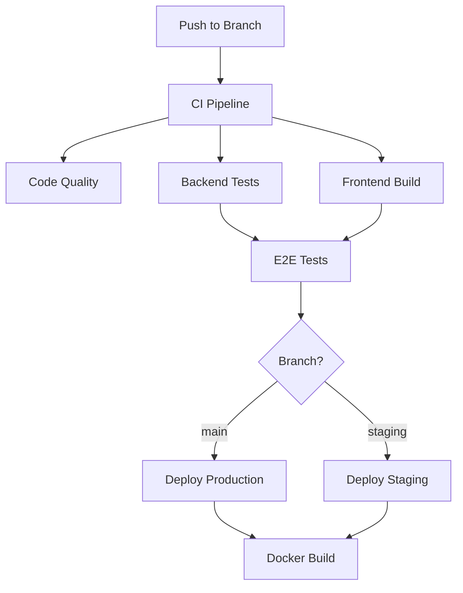

# GitHub Actions CI/CD Workflows

This directory contains comprehensive CI/CD workflows for the CMIS Marketing Limited project.

## 📋 Available Workflows

### 1. CI Pipeline (`ci.yml`)
**Trigger:** Push to main/develop/staging branches, Pull requests

Comprehensive continuous integration pipeline including:
- **Code Quality Checks**: Laravel Pint linting
- **Backend Tests**: PHPUnit tests with coverage on PHP 8.2 and 8.3
- **Frontend Build**: Vite asset compilation
- **E2E Tests**: Playwright browser tests
- **Security Scanning**: Dependency vulnerability checks

**Services:**
- PostgreSQL 15
- Redis 7

**Artifacts:**
- Test results (JUnit XML)
- Coverage reports
- Frontend build files
- Playwright reports

### 2. Laravel Tests (`laravel-tests.yml`)
**Trigger:** Push/PR to main branch

Enhanced Laravel testing workflow with:
- PostgreSQL and Redis services
- Code coverage with minimum 70% threshold
- Dependency caching
- SSH agent support
- Database seeding

### 3. Deployment (`deploy.yml`)
**Trigger:** Push to main/staging, Manual dispatch

Automated deployment to staging and production:
- **Staging Deployment**: Auto-deploy on staging branch
- **Production Deployment**: Auto-deploy on main branch with safeguards
- Database backup before production deployment
- Zero-downtime deployment with maintenance mode
- Automatic rollback on failure
- Health checks after deployment

**Required Secrets:**
- `STAGING_SSH_PRIVATE_KEY`
- `STAGING_HOST`
- `STAGING_USER`
- `STAGING_PATH`
- `PRODUCTION_SSH_PRIVATE_KEY`
- `PRODUCTION_HOST`
- `PRODUCTION_USER`
- `PRODUCTION_PATH`
- `PRODUCTION_DB_PASSWORD`
- `PRODUCTION_DB_USER`
- `PRODUCTION_DB_NAME`

### 4. Docker Build & Push (`docker.yml`)
**Trigger:** Push to main/develop, Tags, Pull requests

Container image management:
- Multi-platform builds (AMD64, ARM64)
- Docker Buildx caching
- Image tagging strategy (branch, semver, SHA)
- GitHub Container Registry (GHCR)
- Trivy security scanning
- SARIF upload to GitHub Security

### 5. Performance Monitoring (`performance.yml`)
**Trigger:** Push/PR to main, Weekly schedule

Performance analysis workflows:
- **Lighthouse CI**: Web performance audits
- **Bundle Size Analysis**: Frontend asset size tracking
- Performance metrics reporting

### 6. Release Management (`release.yml`)
**Trigger:** Version tags (v*.*.*), Manual dispatch

Automated release process:
- Automatic changelog generation
- Release archive creation
- Checksum generation
- GitHub Release creation
- Asset upload
- Pre-release detection

### 7. PR Automation (`pr-automation.yml`)
**Trigger:** PR events

Pull request automation:
- Auto-labeling based on changed files
- PR size labeling
- Auto-assign reviewers
- Conventional commit validation
- PR statistics comments
- Auto-merge for approved Dependabot PRs

### 8. Cache Cleanup (`cache-cleanup.yml`)
**Trigger:** Weekly schedule (Sundays 2 AM UTC), Manual dispatch

Automated cache maintenance:
- Cleanup old workflow caches
- Reduce storage usage
- Optimize CI performance

### 9. Claude Code Workflows
#### `claude.yml`
Triggered by @claude mentions in issues and PRs

#### `claude-code-review.yml`
Automated code review on PR creation/update

## 🔧 Dependabot Configuration

File: `dependabot.yml`

Automated dependency updates for:
- **Composer** (PHP packages): Weekly on Mondays
- **npm** (JavaScript packages): Weekly on Mondays
- **GitHub Actions**: Weekly on Mondays

Configuration:
- Auto-labeling by package ecosystem
- Auto-reviewers assignment
- Conventional commit messages
- Major version updates ignored by default

## 📊 Workflow Dependencies



## 🚀 Setup Instructions

### 1. Configure Secrets

Add the following secrets to your GitHub repository:

**Deployment Secrets:**
```
STAGING_SSH_PRIVATE_KEY
STAGING_HOST
STAGING_USER
STAGING_PATH
PRODUCTION_SSH_PRIVATE_KEY
PRODUCTION_HOST
PRODUCTION_USER
PRODUCTION_PATH
PRODUCTION_DB_PASSWORD
PRODUCTION_DB_USER
PRODUCTION_DB_NAME
```

**Optional Secrets:**
```
SSH_PRIVATE_KEY (for Laravel tests)
CLAUDE_CODE_OAUTH_TOKEN (for Claude automation)
```

### 2. Enable GitHub Packages

For Docker workflow to work:
1. Go to Settings > Actions > General
2. Enable "Read and write permissions" for GITHUB_TOKEN
3. Enable "Allow GitHub Actions to create and approve pull requests"

### 3. Configure Branch Protection

Recommended rules for `main` branch:
- Require pull request reviews
- Require status checks to pass:
  - `Code Quality (Laravel Pint)`
  - `Backend Tests (PHP 8.3)`
  - `Frontend Build & Tests`
  - `E2E Tests (Playwright)`
- Require branches to be up to date

### 4. Environment Configuration

Create environments in GitHub:
- **staging**: For staging deployments
- **production**: For production deployments (add required reviewers)

## 🏷️ Labels

The workflows expect these labels to exist:
- `dependencies`, `composer`, `php`
- `npm`, `javascript`
- `github-actions`, `ci`
- `backend`, `frontend`, `tests`
- `documentation`, `database`, `api`, `security`, `models`
- `size/xs`, `size/s`, `size/m`, `size/l`, `size/xl`
- `feature`, `enhancement`, `bug`, `fix`, `chore`

Create them via Settings > Labels or they'll be created automatically.

## 📈 Monitoring

### View Workflow Runs
```bash
gh run list
gh run view <run-id>
gh run watch <run-id>
```

### Check Deployments
```bash
gh deployment list
gh deployment view <deployment-id>
```

### View Artifacts
```bash
gh run download <run-id>
```

## 🔄 Manual Triggers

Some workflows support manual triggering:

```bash
# Trigger deployment
gh workflow run deploy.yml -f environment=staging

# Trigger cache cleanup
gh workflow run cache-cleanup.yml

# Create a release
gh workflow run release.yml -f version=v1.0.0
```

## 📝 Best Practices

1. **Commit Messages**: Use conventional commits (feat, fix, docs, etc.)
2. **PR Size**: Keep PRs small for faster reviews
3. **Testing**: Ensure all tests pass before merging
4. **Security**: Never commit secrets or sensitive data
5. **Documentation**: Update docs when changing workflows

## 🐛 Troubleshooting

### Common Issues

**1. Tests Failing on CI but Passing Locally**
- Check PHP version differences
- Verify database configuration
- Clear cache: `php artisan config:clear`

**2. Deployment Fails**
- Verify secrets are set correctly
- Check SSH key permissions
- Ensure server has enough disk space

**3. Docker Build Fails**
- Check Dockerfile syntax
- Verify base image availability
- Review build logs for specific errors

**4. Dependabot PRs Not Auto-Merging**
- Ensure branch protection rules allow auto-merge
- Check if all status checks pass
- Verify Dependabot approval

## 📚 Additional Resources

- [GitHub Actions Documentation](https://docs.github.com/en/actions)
- [Laravel Testing](https://laravel.com/docs/testing)
- [Playwright Documentation](https://playwright.dev)
- [Conventional Commits](https://www.conventionalcommits.org/)

## 🤝 Contributing

When adding new workflows:
1. Test thoroughly in a separate branch
2. Document the workflow purpose and triggers
3. Update this README
4. Add required labels and secrets documentation
5. Consider workflow dependencies
